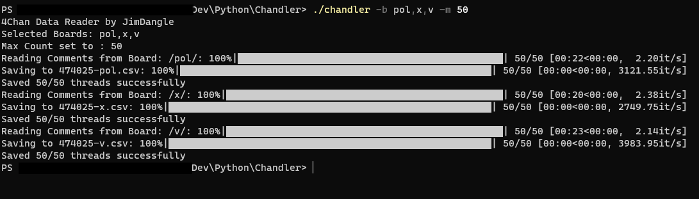

# Chandler

## Description
Chandler is a easy to use tool that can build CSV file datasets based on 4chan posts

## Motivation
I want to expirement with AI and Data Analysis. I felt that 4chan has a lot of very wild and ranging topics with numerous people around the globe using it. I do not think it would have pretty results but I wonder the amount of analysis that can be performed 

## How To Use
After you have the exe downloaded open the directory it has been placed into and type the following command

`./chandler -b <list of boards> -m <max number of threads to look at> -o <output folder>`

e.g to scrape 100 threads from the following boards `b`, `tv`, `x` you would type the following command

`./chandler -b b,tv,x -m 100`

by default Chandler outputs to a folder `/data/` which should be placed next to the executable itself 

### Image of Use

### Example Output

## Args

### `-b`, `--boards`:
    Set the boards you would like to scrape by passing a comma seperated list of board names e.g `pol,b,x,v`

### `-m`, `--maxcount`:
    Set the max amount of threads we would like to see data from by default it will do however many it finds (seems the max it will ever return is 200)

### `-o`, `--output`:
    Set the output folder for the csv files. By default this is `./data/`

## Caveats and things I want to change

Currently it only runs one time. It probably would not be too hard to have it run on intervals for overall collection but I felt that a) I dont want to disturb their site too much, and b) just running on a few boards and a hundred threads per board will generate an insane amount of data (~15000 unique text sections of 5-200 chars)

## Warning

4Chan has many different boards and categories of discussion. The boards you choose to scrape in no way reflect the intentions of this executable.